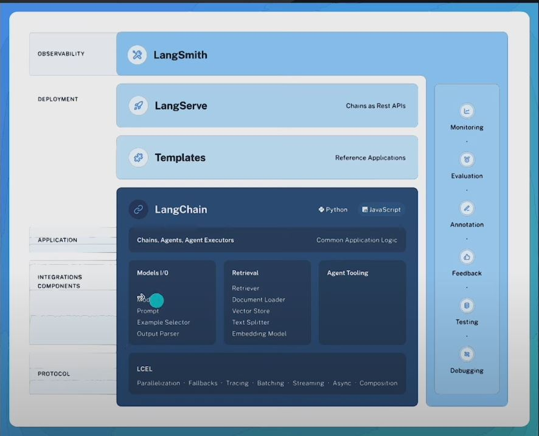

1. What is LangChain

    - Software library designed for building applications with language models

    - Focus on enabling easy experimentation and development of applications that leverage large language models (LLM)

    - Supports all major LLMs
        
        - OpenAI(GPT-3.5 or GPT-4)
        - Azure
        - Anthropic
        - Google Cloud
        - https://python.langchain.com/docs/integrations/providers

2. Framework

    

    - LangChain Libraries

        - Python or JS libraries

    - LangChain Templates

        - A collection of easily deployable reference architectures for a wide variety of tasks

    - LangServe

        - REST API service

    - LangSmith

        - Developer platform to debug, test, evaluate, and monitor chains