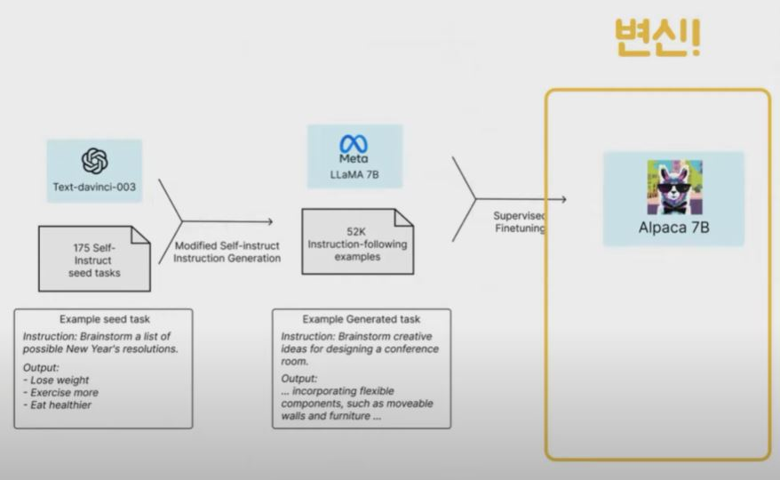
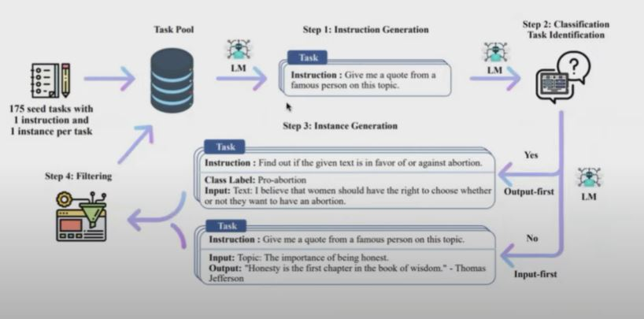

## 1. 알파카(Alpaca)

- 메타에서 공개한 LLaMA 7B 모델을 파인튜닝한 Instruction-following 모델
- GPT 3.5 (text-davinci-003)를 사용하여 생성한 52K개의 학습 데이터로 파인튜닝
- 알파카는 OpenAI의 text-davinci-003과 비슷한 성능을 보이지만, 놀랍게도 크기가 작고 저렴하게 학습 가능

## 2. 주요 특징

- 훈련 방식과 학습 데이터 공개
- 추후 모델 가중치(checkpoint)도 공개 예정. 대화형 데모 공개

## 3. 모델 평가

- 5명의 학생 저자가 직접 평가
- text-davinci-003 vs Alpaca 7B 블라인드 비교
- 두 모델의 성능이 매우 유사
- 90대 89로 알파카 승리

## 4. Self-Instruct

- 파인튜닝 시 언어모델이 직접 문장을 생성해서 파인튜닝할 수 있게끔 하자는 내용

## 5. 프롬프트 템플릿

